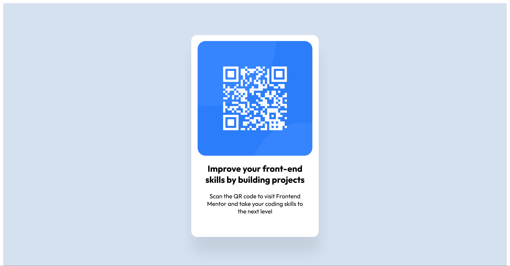

# Frontend Mentor - QR code component solution

This is a solution to the [QR code component challenge on Frontend Mentor](https://www.frontendmentor.io/challenges/qr-code-component-iux_sIO_H). Frontend Mentor challenges help you improve your coding skills by building realistic projects. 

## Table of contents

- [Overview](#overview)
  - [Screenshot](#screenshot)
  - [Links](#links)
- [My process](#my-process)
  - [Built with](#built-with)
  - [What I learned](#what-i-learned)
  - [Continued development](#continued-development)
  - [Useful resources](#useful-resources)


**Note: Delete this note and update the table of contents based on what sections you keep.**

## Overview

### Screenshot



This is a screenshot of my solution.

### Links

- Solution URL: [Add solution URL here](https://github.com/yvonnem111/qr-code-component-main/blob/main/index.html)
- Live Site URL: [Add live site URL here](https://htmlpreview.github.io/?https://github.com/yvonnem111/qr-code-component-main/blob/main/index.html)

## My process

### Built with

- Semantic HTML5 markup
- CSS
- Flexbox


### What I learned

That practice makes perfect.
this is how I would have done it before with margin and text center
a more simple solution would have been this:

``` html
<div class="card">
    
    <h3>Improve your front-end skills by building projects</h3>
    <p>Scan the QR code to visit Frontend Mentor and take your coding skills to the next level</p>
  </div>
```
```css
.card {
	padding: 12px;
	background-color: hsl(0, 0%, 100%);
	border-radius: 15px;
	margin-top: 150px;
	width: 270px;
	margin: 0 auto;
	text-align: center;
}
```

### Continued development

Continue practicing different layouts.

### Useful resources

- [Example resource 1](https://css-tricks.com/snippets/css/a-guide-to-flexbox/) - This helps me when I forget flexbox elements. I like how easy it is to follow.

<!-- ## Author

- Website - [Yvonne](www.yvonnejoseph.com) -->

